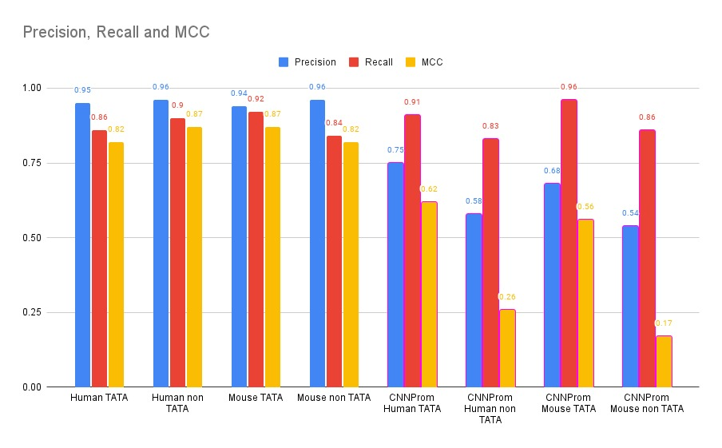
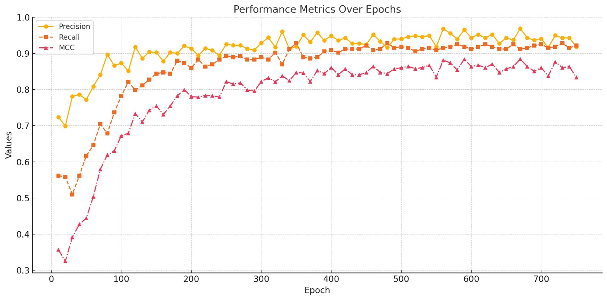

# Promoter Prediction in Eukaryotic Genomes

This repository contains Jupyter Notebook implementations for predicting promoter regions in eukaryotic genomes, focusing on **human** and **mouse** DNA sequences. The project leverages advanced deep learning techniques to accurately identify and classify **TATA** and **non-TATA** promoters, which are key to understanding gene regulation, epigenetics, and potential drug targets.

## Project Overview

Promoter regions play a crucial role in regulating gene expression by determining when and where genes are activated. This project aims to develop a hybrid **Convolutional Neural Network (CNN)** and **Long Short-Term Memory (LSTM)** deep learning architecture to capture both local sequence motifs and long-range dependencies in DNA sequences.

Key features of this project include:
- **TATA vs. non-TATA Promoters**: Differentiating between TATA promoters, characterized by the conserved TATA-box motif, and non-TATA promoters, which lack such motifs and are harder to identify.
- **Negative Set Reconstruction**: Incorporating realistic negative examples with controlled noise to improve model performance and reduce false positives.
- **Balanced Dataset Preparation**: Standardizing sequence lengths and ensuring a balanced representation of promoter types for robust model training.

## Methodology

### 1. **Model Architecture**
The model combines the strengths of:
- **CNNs**: Efficiently detect local motifs like the TATA box in DNA sequences.
- **LSTMs**: Capture long-range dependencies and contextual relationships within sequences, essential for identifying non-TATA promoters.

### 2. **Dataset Preparation**
- Data is curated from the **Eukaryotic Promoter Database (EPD)** and includes:
  - **TATA Promoters**: Conserved TATA-box motif regions.
  - **Non-TATA Promoters**: Associated with housekeeping genes, lacking the TATA-box motif.
  - **Negative Examples**: Non-promoter sequences sampled from regions unlikely to contain promoters, with controlled noise introduced for realism.
- Sequences are standardized to a length of 300 base pairs using truncation and padding.
- One-hot encoding is applied to represent nucleotide sequences (`A`, `T`, `G`, `C`) as binary vectors.

### 3. **Evaluation Metrics**
Model performance is assessed using:
- **Precision**
- **Recall**
- **Matthews Correlation Coefficient (MCC)**

## Repository Structure

The repository is organized as follows:
├── mouse.ipynb # Notebook for mouse promoter sequence analysis 
├── human.ipynb # Notebook for human promoter sequence analysis 
├── data
    ├── human 
        ├── nonTATA # human non TATA protein sequences 
        ├── TATA # human TATA protein sequences 
    ├── mouse
        ├── nonTATA # mouse non TATA protein sequences 
        ├── TATA#  mouse TATA protein sequences 
├── README.md # Documentation for the repository

## Notebooks

### 1. **mouse_TATA.ipynb**
This notebook implements the hybrid CNN-LSTM architecture for predicting promoter regions in **mouse** DNA sequences. It includes:
- Data preprocessing, including one-hot encoding and negative set reconstruction.
- Model training and evaluation on TATA and non-TATA promoter sequences.
- Performance visualization (e.g., precision, recall, MCC over epochs).

### 2. **human_TATA.ipynb**
This notebook is analogous to `mouse_TATA.ipynb`, but focuses on **human** DNA sequences. The methodology and architecture are the same, with adaptations for the specific dataset.

## Key Highlights
- **Dataset Diversity**: Negative examples are crafted with realistic noise to improve generalizability.
- **Hybrid Model Design**: Combining CNNs for motif detection and LSTMs for contextual understanding.
- **Robust Validation**: Models are validated using metrics to ensure unbiased performance evaluation.

## Results
The developed models demonstrate strong performance across precision, recall, and MCC metrics, highlighting their capability to predict both TATA and non-TATA promoters effectively. Comparisons with state-of-the-art tools such as **CNNprom** underscore the strengths of this hybrid approach.

## Acknowledgments
This work utilizes data from the Eukaryotic Promoter Database (EPD) and compares performance against existing tools like CNNprom. Special thanks to the researchers and developers who made these resources publicly available.

